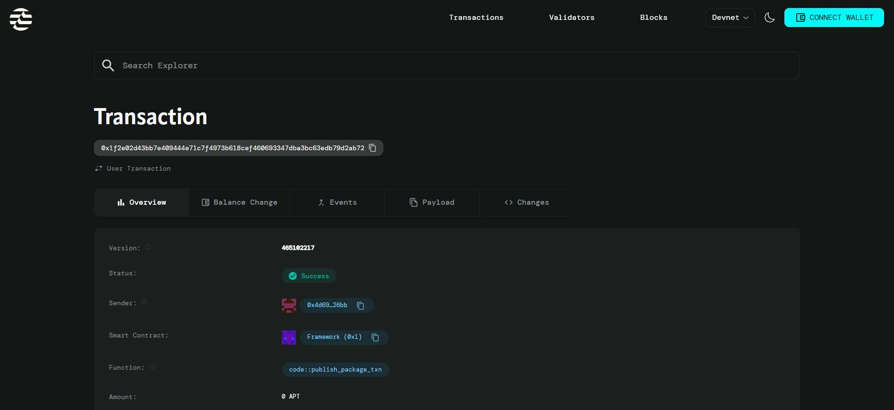

# On-chain Generative Art Studio

## Project Description

The On-chain Generative Art Studio is a blockchain-based NFT platform built on the Aptos blockchain that enables users to mint unique generative art NFTs. Each NFT is created with a unique random seed generated at the moment of minting, combining the current timestamp with the total minting count to ensure true uniqueness. This approach guarantees that every piece of art is one-of-a-kind and verifiably random, with all generation parameters stored permanently on-chain.
 
## Contract Details
Transaction ID:
0x1f2e02d43bb7e409444e71c7f4973b618cef460693347dba3bc63edb79d2ab72

## Project Vision

Our vision is to democratize generative art creation by providing artists and collectors with a decentralized platform where art is created through the magic of blockchain randomness. We aim to bridge the gap between traditional generative art and blockchain technology, creating a transparent ecosystem where each artwork's uniqueness is guaranteed by cryptographic principles. By storing generation parameters on-chain, we ensure permanent provenance and enable future artists to build upon and reference previous works.

## Key Features

- **True On-chain Randomness**: Each NFT is minted with a unique seed generated from blockchain timestamp and minting sequence, ensuring genuine randomness and unpredictability in art generation.

- **Transparent Pricing Model**: Fixed mint price set by the studio creator, providing clarity and fairness for all collectors entering the ecosystem.

- **Immutable Provenance**: All NFT metadata including token ID, generation seed, mint timestamp, and ownership are permanently stored on the Aptos blockchain for complete transparency.

- **Simple Two-Function Architecture**: Streamlined smart contract with just two core functions - studio initialization and NFT minting - making it easy to understand, audit, and interact with.

- **Automated Minting Statistics**: Built-in tracking of total minted NFTs, enabling collectors to know the rarity and position of their artwork in the collection sequence.

## Future Scope

- **Dynamic Pricing Mechanisms**: Implement bonding curves or Dutch auction models to create more sophisticated pricing strategies that reward early adopters.

- **Trait Randomization System**: Expand the randomness engine to generate multiple attributes, colors, patterns, and styles based on the seed value for richer artistic variation.

- **Secondary Market Integration**: Add transfer functions and marketplace integration to enable peer-to-peer trading of minted NFTs with proper royalty distribution.

- **Artist Collaboration Tools**: Build multi-artist studio capabilities where different creators can contribute algorithms and share revenue from collaborative collections.

- **Rarity System**: Implement trait-based rarity calculations that make certain seed combinations more valuable than others, adding collectibility layers.

- **Cross-chain Bridging**: Enable NFT transfers across different blockchain networks to expand the reach and utility of the generative art pieces.

- **Interactive Art Evolution**: Allow NFT holders to "evolve" their art over time by using additional randomness inputs while maintaining the original seed integrity.
